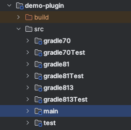

[](https://central.sonatype.com/artifact/io.github.gmazzo.gradle.multiapi/io.github.gmazzo.gradle.multiapi.gradle.plugin)
[](https://plugins.gradle.org/plugin/io.github.gmazzo.gradle.multiapi)
[](https://github.com/gmazzo/gradle-multiapi-dev-plugin/actions/workflows/ci-cd.yaml)
[](https://codecov.io/gh/gmazzo/gradle-multiapi-dev-plugin)
[](https://sourcegraph.com/search?q=content:io.github.gmazzo.gradle.multiapi+-repo:github.com/gmazzo/gradle-multiapi-dev-plugin)

# gradle-multiapi-dev-plugin
A Gradle plugin allows targeting multiple `gradleApi()`s versions by leveraging [Java Plugin's Variant Features](https://docs.gradle.org/current/userguide/feature_variants.html).
 
# Usage
Apply the plugin at your `java-gradle-plugin` project:
```kotlin
plugins {
    `java-gradle-plugin`
    id("io.github.gmazzo.gradle.multiapi") version "<latest>" 
}

gradlePlugin {
    apiTargets("7.0", "8.1", "8.13")

    plugins {
        create("myPlugin") {
            // configure your plugin here
        }
    }
}
```
For each declared, a dedicated `gradle<version>` source will be created (with a companion `gradle<version>Test` test suite)



> [!NOTE]
> `main` and `test` source sets will act as common shared code for all variants.

> [!IMPORTANT]
> The plugin will automatically configure the `gradleApi()` and `gradleTestkit()` with the right target version on each source.
> Do not declare them manually (as you usually will do) since will may breck the classpath.
> 
> When `kotlin` plugin is applied, also `gradleKotlinDsl()` will be configured.

## How to design targeting multiple Gradle versions
An opinionated approach will be to leverage Java's `ServiceLoader` mechanism to load the right implementation for each target version.

For instance, considering [Gradle's 8.13 breaking change on `JvmTestSuite`](https://github.com/gradle/gradle/pull/31706)
where `TestSuiteType` was dropped in favor of new `TestSuiteName`, this could be addressed as the following:

In `main` source set:
```kotlin
interface GradleAPIAdapter {

    fun AttributeContainer.setDefaultTestSuite(objects: ObjectFactory)

    fun AggregateTestReport.setDefaultTestSuite()

    fun JacocoCoverageReport.setDefaultTestSuite()

    companion object : GradleAPIAdapter by ServiceLoader.load(GradleAPIAdapter::class.java).single()

}
```
And a resource pointing to its implementation:
`META-INF/services/io.github.gmazzo.android.test.aggregation.GradleAPIAdapter`:
```
io.github.gmazzo.android.test.aggregation.GradleAPIAdapterImpl
```

Then in `gradle8.0` source set:
```kotlin
import org.gradle.api.attributes.TestSuiteType.TEST_SUITE_TYPE_ATTRIBUTE
import org.gradle.api.attributes.TestSuiteType.UNIT_TEST

class GradleAPIAdapterImpl : GradleAPIAdapter {

    override fun AttributeContainer.setDefaultTestSuite(objects: ObjectFactory) {
        attribute(TEST_SUITE_TYPE_ATTRIBUTE, objects.named(UNIT_TEST))
    }

    override fun AggregateTestReport.setDefaultTestSuite() {
        testType.set(UNIT_TEST)
    }

    override fun JacocoCoverageReport.setDefaultTestSuite() {
        testType.set(UNIT_TEST)
    }

}
```

And in `gradle813` source set (the version introducing the breaking change):
```kotlin
import org.gradle.api.attributes.TestSuiteName.TEST_SUITE_NAME_ATTRIBUTE
import org.gradle.api.tasks.SourceSet.TEST_SOURCE_SET_NAME

class GradleAPIAdapterImpl : GradleAPIAdapter {

    override fun AttributeContainer.setDefaultTestSuite(objects: ObjectFactory) {
        attribute(TEST_SUITE_NAME_ATTRIBUTE, objects.named(TEST_SOURCE_SET_NAME))
    }

    override fun AggregateTestReport.setDefaultTestSuite() {
        testSuiteName.set(TEST_SOURCE_SET_NAME)
    }

    override fun JacocoCoverageReport.setDefaultTestSuite() {
        testSuiteName.set(TEST_SOURCE_SET_NAME)
    }

}
```

> [!NOTE]
> This is a working example on my [Android Test Aggregation plugin](https://github.com/gmazzo/gradle-android-test-aggregation-plugin/blob/main/plugin/src/main/kotlin/io/github/gmazzo/android/test/aggregation/GradleAPIAdapter.kt)